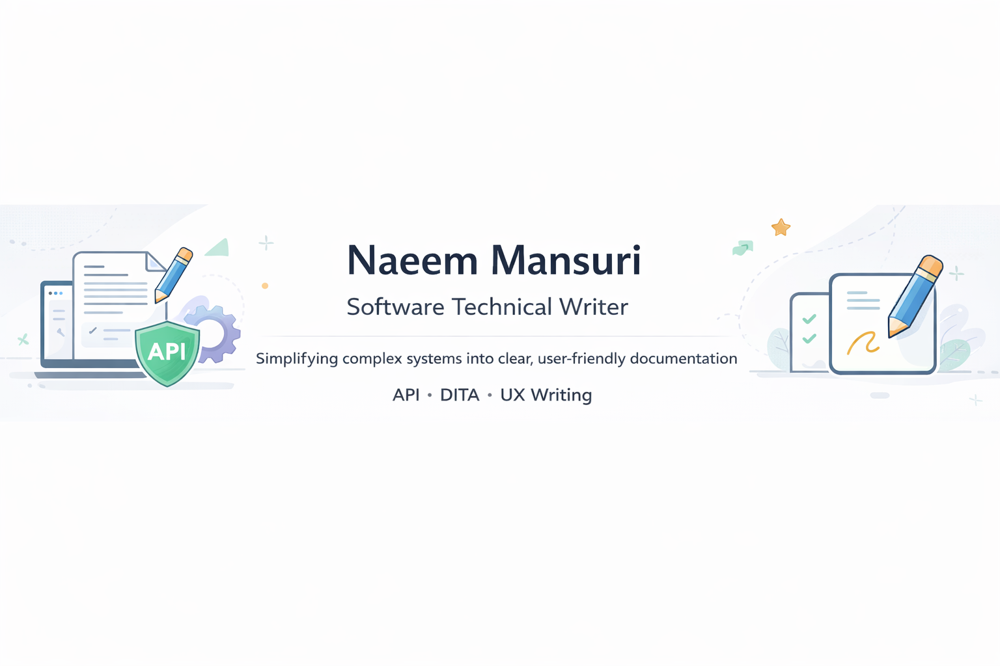

  

<h1 align="center">👋 Hi, I'm Naeem Mansuri</h1>

  

---

🚀 Technical Writer focused on clarity, usability, and real-world documentation  
💼 Software Technical Writer @ Cognizant • 📍 Hyderabad, India  

---

  
  
  
  

---

  
  

  

---

## 🚀 What I Deliver
I create documentation that reduces user confusion and improves product usability.

---

## 🎯 Core Expertise
- 📘 User Guides & Product Documentation  
- 🔗 API Documentation (REST, JSON, Endpoints)  
- 📄 SOPs & Process Documentation  
- ⚙️ Production Documentation & Version Control  

---

## 💡 What I Do Best
- Simplify complex systems into clear, user-friendly content  
- Improve onboarding experience through structured documentation  
- Reduce user confusion with real-world examples  
- Design documentation for usability, not just information  

---

## 🛠️ Tools & Technologies

---

✨ **Portfolio built with real-world documentation scenarios and structured writing principles**

---

# 🚀 Featured Project

## 💳 Fintech App Documentation ⭐

  

📌 End-to-end documentation for a digital payments system  
📌 Covers transaction lifecycle, API flows, and error handling  

### 🔥 Highlights
- Designed complete transaction lifecycle documentation  
- Integrated API + user guide structure  
- Added real-world failure scenarios  

👉 **[View Full Project](https://github.com/mansurinaeem22/fintech-app-documentation)**

---

## 📂 Other Projects

### 📘 User Guide
Clear, structured documentation focused on usability  
👉 https://github.com/mansurinaeem22/technical-writing-portfolio  

---

### 🔗 API Documentation
Detailed API references with request/response examples  
👉 https://github.com/mansurinaeem22/api-documentation-sample  

---

### 📄 SOP Documentation
Step-by-step operational workflows  
👉 https://github.com/mansurinaeem22/sop-documentation  

---

### 📰 Release Notes
Structured communication of product updates and improvements  
👉 https://github.com/mansurinaeem22/release-notes-sample  

---

## 🧠 Skills

- Technical Documentation  
- API Documentation  
- DITA  
- Markdown  
- UX Writing  
- Version Control (Git & GitHub)  

---

## 📫 Contact

📌 LinkedIn: https://www.linkedin.com/in/naeem-mansuri-01a487203/  
📧 Email: mansurinaeem375@gmail.com  

---

## 🎯 Goal

To create documentation that improves user experience and reduces complexity.
